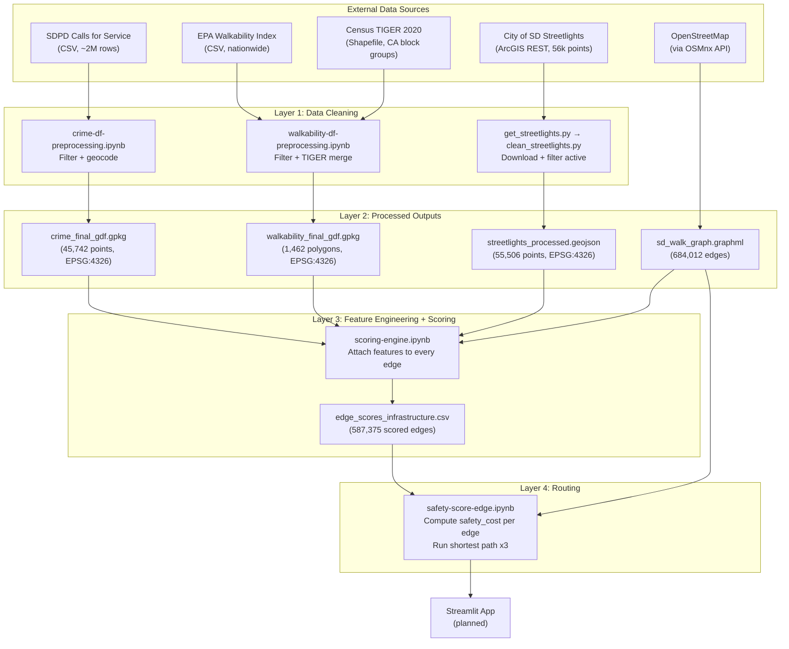
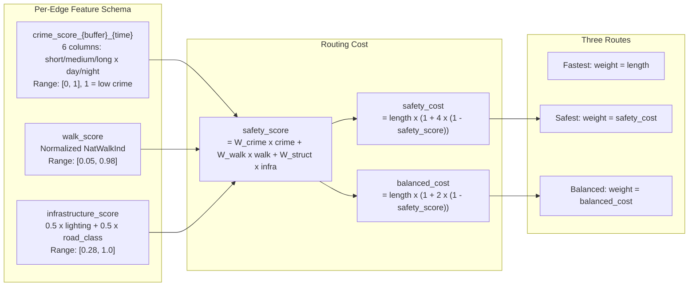

# SafePath Design Document

> Data pipeline, scoring methodology, and design rationale for the SafePath route recommendation tool. This is the single technical reference for how the system works.

**Project:** SafePath (DS3 at UC San Diego, Spring 2026)
**Team:** 5 people. Lead: Vanshika.
**Last updated:** 2026-05-18

---

## 1. Problem Statement

People who feel vulnerable walking alone (students, women, anyone walking at night or in unfamiliar areas) have no way to choose a route based on how safe or comfortable it feels. Google Maps optimizes for speed. SafePath optimizes for a combination of speed, crime exposure, walkability, and lighting.

**Scope:** Proof-of-concept for San Diego. Input: two addresses. Output: three routes (fastest, safest, balanced) with plain-English explanations.

---

## 2. System Architecture



| Component | What it does | Key files |
|---|---|---|
| Data ingestion | Download and cache raw datasets | `src/data/get_streetlights.py`, preprocessing notebooks |
| Data cleaning | Filter, geocode, validate, save to standard formats | Notebooks in `notebooks/`, `src/data/clean_streetlights.py` |
| Feature engineering | Attach per-edge scores (crime, walkability, infrastructure) to the OSM graph | `notebooks/scoring-engine.ipynb` |
| Routing engine | Compute route costs, run shortest path three times, display comparison | `notebooks/safety-score-edge.ipynb` |
| Web interface | Streamlit app for user interaction | `app/` (planned) |

---

## 3. Data Sources

| Dataset | Source | Status | Output |
|---|---|---|---|
| SDPD Calls for Service | [data.sandiego.gov](https://data.sandiego.gov/datasets/police-calls-for-service/) | Cleaned | `crime_final_gdf.gpkg` |
| EPA Walkability Index | [Kaggle mirror](https://www.kaggle.com/datasets/stacey06/u-s-walkability-index) of EPA SLD v3.0 | Cleaned | `walkability_final_gdf.gpkg` |
| Census TIGER 2020 | [Census Bureau](https://www2.census.gov/geo/tiger/TIGER2020/BG/tl_2020_06_bg.zip) | Used in merge | (merged into walkability file) |
| City of SD Streetlights | [ArcGIS REST layer](https://webmaps.sandiego.gov/arcgis/rest/services/Planning/PLN_Mobility/MapServer/1) | Cleaned | `streetlights_processed.geojson` |
| OpenStreetMap | [OSMnx API](https://osmnx.readthedocs.io) | Downloaded | `sd_walk_graph.graphml` |
| Buffered bike lanes | [data.sandiego.gov](https://data.sandiego.gov/datasets/bike-route-lines/) | Deferred to future version | -- |

**SDPD Calls for Service.** One row per police call with date, time, call type, priority, disposition, and address. We filter to confirmed pedestrian-relevant incidents, then geocode addresses to lat/lon points. Reference codebooks in [`docs/references/`](references/).

**EPA Walkability Index.** One row per Census block group with `NatWalkInd` (1-20 score combining street connectivity, transit, and land use mix). Methodology: [EPA SLD v3.0 PDF](https://www.epa.gov/system/files/documents/2023-10/epa_sld_3.0_technicaldocumentationuserguide_may2021_0.pdf). Merged with Census TIGER polygons so each block group has both a score and a geographic boundary.

**City Streetlights.** Point geometry for every city-maintained light. Snapshot 2026-04-30: 56,049 raw features, 55,506 active after filtering. Full cleaning report: [`docs/data/streetlights/`](data/streetlights/). No additional public streetlight data exists for this region -- see [`EXTERNAL_DATASETS_AUDIT.md`](data/streetlights/EXTERNAL_DATASETS_AUDIT.md) for the 9-source investigation.

**OpenStreetMap.** San Diego walking network: 684,012 edges. Every other dataset gets spatially joined to OSM edges so the routing engine reads scores from one graph.

All datasets are snapshots, not live feeds.

| Dataset | Snapshot date |
|---|---|
| Crime | Limited 2026 window |
| EPA Walkability | 2021 index |
| Streetlights | 2026-04-30 |
| OSM | Downloaded fresh per session |

---

## 4. Data Cleaning Pipelines

### Crime

Pipeline: [`crime-df-preprocessing.ipynb`](../notebooks/crime-df-preprocessing.ipynb) → `crime_final_gdf.gpkg`

1. Load SDPD Calls for Service CSV from `data/raw/`
2. Filter by `DISPOSITION` to confirmed outcomes (arrest, report taken, officer action). Drops false alarms.
3. Filter `CALL_TYPE` to pedestrian-relevant categories (violent crime, active threats, weapons, public safety hazards).
4. Build `full_address` from address parts + `, San Diego, CA`
5. Geocode each unique address through [Nominatim](https://nominatim.openstreetmap.org) at 1 req/sec. Results cached in `geocode_cache.json` -- first run takes hours; reruns use cache.
6. Drop rows where geocoding failed. Save as GeoPackage in EPSG:4326.

**Result:** 45,742 geocoded crime points.

### Walkability

Pipeline: [`walkability-df-preprocessing.ipynb`](../notebooks/walkability-df-preprocessing.ipynb) → `walkability_final_gdf.gpkg`

1. Load EPA Walkability CSV, filter to San Diego County (`STATEFP == 6`, `COUNTYFP == 73`)
2. Fix `GEOID10` to 12-character zero-padded string (pandas loads as float, losing leading zeros)
3. Merge with [Census TIGER block group shapefile](https://www2.census.gov/geo/tiger/TIGER2020/BG/tl_2020_06_bg.zip) on GEOID
4. Save as GeoPackage in EPSG:4326

**Result:** 1,462 block group polygons with walkability scores.

### Streetlights

Pipeline: [`src/data/get_streetlights.py`](../src/data/get_streetlights.py) → [`src/data/clean_streetlights.py`](../src/data/clean_streetlights.py) → `streetlights_processed.geojson`

1. Page ArcGIS REST layer (2,000 records/page) → `data/raw/streetlights/`
2. Filter: `STATUS == 'A'` AND `MAPNG_STAT_CD ∈ {'AB','OP'}` (drops 543 inactive lights)
3. Flag duplicate `SAPOBJNR` (0 this snapshot). Trim to scoring columns. Save as GeoJSON in EPSG:4326.

**Result:** 55,506 active streetlights. Tie-out: 56,049 - 543 = 55,506.

Full validation report: [`CLEANING_AND_VALIDATION.md`](data/streetlights/CLEANING_AND_VALIDATION.md).

### Coordinate systems

| CRS | Units | Use |
|---|---|---|
| EPSG:4326 | Degrees (lat/lon) | Storage, display, file output |
| EPSG:3857 | Meters | Distance calculations, buffering, spatial joins |

Any operation involving "within X meters" (crime buffers, streetlight proximity) must be done in EPSG:3857. Reproject before buffering, then back to EPSG:4326 for storage.

---

## 5. Feature Engineering and Edge Scores

Each cleaned dataset becomes one or more numbers attached to each street edge in the OSM walking network. The scoring step reads only these per-edge features, never the raw data.

### Edge score file schema

`edge_scores_infrastructure.csv` — 587,375 rows, produced by `scoring-engine.ipynb`:

| Column | Type | Range | What it captures |
|---|---|---|---|
| `u`, `v`, `key` | int | OSM node IDs | Edge identifier (MultiDiGraph key) |
| `crime_score_short_day` | float | [0, 1] | Crime exposure within 50 m buffer, daytime (routes < 500 m) |
| `crime_score_short_night` | float | [0, 1] | Crime exposure within 50 m buffer, nighttime |
| `crime_score_medium_day` | float | [0, 1] | Crime exposure within 100 m buffer, daytime (routes 500 m - 2 km) |
| `crime_score_medium_night` | float | [0, 1] | Crime exposure within 100 m buffer, nighttime |
| `crime_score_long_day` | float | [0, 1] | Crime exposure within 150 m buffer, daytime (routes > 2 km) |
| `crime_score_long_night` | float | [0, 1] | Crime exposure within 150 m buffer, nighttime |
| `walk_score` | float | [0.05, 0.98] | EPA National Walkability Index normalized to [0, 1] |
| `infrastructure_score` | float | [0.28, 1.0] | Combined lighting + pedestrian road suitability |

All scores follow the convention: **1 = best (safest/most walkable), 0 = worst**.

### How features are computed

**Crime scoring.** Each SDPD incident receives a severity score (0.4 to 3.0 by call type, using a lookup table that combines FBI UCR hierarchy with pedestrian exposure risk) and a time multiplier (1.1 to 1.3x for night incidents involving robbery, assault, battery, or threats; 1.0x otherwise). Combined weight = `severity_score * time_multiplier`. Day = hours 6-20; night = hours 21-5.

Per-edge aggregation: buffer the edge geometry (50 m, 100 m, or 150 m in EPSG:3857), spatial join to sum `combined_weight` of all incidents inside the buffer, then normalize:

```
crime_score = 1 - (log1p(raw_sum) / p95_of_log_values)
```

Clipped to [0, 1]. Zero-crime edges receive 1.0 (safe). About 76% of edges have no crime in their buffer.

**Walkability scoring.** `walk_score = (NatWalkInd - 1) / 19`, where `NatWalkInd` is the EPA index (scale 1-20) for the census block group containing the edge midpoint. Midpoints are used because long edges can cross two block groups. Edges outside any polygon get 0.5 (neutral fallback).

**Infrastructure scoring.** Combines a lighting signal with pedestrian road suitability:

```
infrastructure_score = 0.5 * lighting_signal + 0.5 * road_class_score
```

| Edge population | Share | Lighting signal |
|---|---|---|
| Streetlight within 30 m | 31.2% | `light_score` -- continuous [0, 1] from log-normalized count |
| No streetlight within 30 m | 68.8% | `lighting_class_score` -- discrete [0.15, 0.90] by road type |

### Road class score mapping

| OSM highway type | Score | Rationale |
|---|---|---|
| footway, pedestrian | 1.00 | Purpose-built for walking |
| path | 0.90 | Usually pedestrian-friendly |
| cycleway | 0.85 | Shared-use infrastructure |
| living_street | 0.80 | Low-speed, pedestrian priority |
| residential | 0.70 | Low traffic |
| unclassified | 0.60 | Variable |
| tertiary | 0.50 | Moderate traffic |
| secondary | 0.35 | Heavier traffic |
| primary | 0.20 | High traffic exposure |
| trunk | 0.10 | Multi-lane, high speed |
| motorway | 0.00 | Not walkable |

Edges with highway types not in this map receive 0.5 (neutral fallback).

---

## 6. Scoring Pipeline Detail

```mermaid
flowchart TD
    subgraph Crime["Crime Feature Pipeline"]
        CR1["SDPD incidents<br/>(45,742 points)"]
        CR2["Assign severity_score<br/>(0.4 - 3.0 by call type)"]
        CR3["Apply time_multiplier<br/>(1.0 - 1.3 for night crimes)"]
        CR4["Buffer each edge<br/>(50m / 100m / 150m in EPSG:3857)"]
        CR5["Spatial join: sum<br/>combined_weight per edge"]
        CR6["Normalize:<br/>1 - log1p(sum) / p95"]
        CR7["crime_score_{buffer}_{time}<br/>[0, 1]"]
    end

    subgraph Walk["Walkability Pipeline"]
        WK1["EPA block groups<br/>(1,462 polygons)"]
        WK2["Edge midpoint<br/>interpolate(0.5)"]
        WK3["Point-in-polygon<br/>spatial join"]
        WK4["Normalize:<br/>(NatWalkInd - 1) / 19"]
        WK5["walk_score<br/>[0, 1]"]
    end

    subgraph Infra["Infrastructure Pipeline"]
        IF1["Streetlights<br/>(55,506 points)"]
        IF2["Buffer edges 30m<br/>spatial join + count"]
        IF3{"Has lights<br/>within 30m?"}
        IF4["light_score<br/>(31.2% of edges)"]
        IF5["lighting_class_score<br/>road-type proxy<br/>(68.8% of edges)"]
        IF6["road_class_score<br/>by OSM highway type"]
        IF7["infrastructure_score<br/>= 0.5 x lighting + 0.5 x road"]
    end

    CR1 --> CR2 --> CR3 --> CR4 --> CR5 --> CR6 --> CR7
    WK1 --> WK3
    WK2 --> WK3 --> WK4 --> WK5
    IF1 --> IF2 --> IF3
    IF3 -->|Yes| IF4
    IF3 -->|No| IF5
    IF4 --> IF7
    IF5 --> IF7
    IF6 --> IF7
```



---

## 7. Routing Profiles and Cost Formula

The system uses **routing profiles** -- each profile defines feature weights and a cost multiplier. The router computes a profile-specific cost for every edge, then runs shortest path.



### Weight profiles

| Context | Crime weight | Walk weight | Infra weight | Cost multiplier |
|---|---|---|---|---|
| Day (safest) | 0.50 | 0.25 | 0.25 | 4 |
| Night (safest) | 0.45 | 0.25 | 0.30 | 4 |
| Balanced | same as above | same | same | 2 |
| Fastest | n/a | n/a | n/a | 0 (pure length) |

The buffer size is selected dynamically: short (50 m) for routes under 500 m, medium (100 m) for 500 m to 2 km, long (150 m) for routes over 2 km.

Day vs. night is determined automatically from the system clock using the `suntime` library.

---

## 8. Key Design Decisions and Tradeoffs

### Why three buffer sizes for crime scoring

A fixed 100 m buffer over-smooths short routes (< 500 m) where every edge shares the same crime catchment area. The router picks the appropriate buffer at query time based on total route length: 50 m for short walks, 100 m for medium, 150 m for long.

**Tradeoff:** More complexity in the scoring engine and larger CSV output. Accepted because route differentiation on short campus walks was unacceptable with a single buffer.

### Why log + p95 normalization instead of min-max

Raw crime totals follow a power law distribution (downtown outliers compress everything else to near-zero). `log1p` spreads the mid-range values. Capping at the 95th percentile (not max) prevents one extreme outlier from compressing the useful score range.

**Tradeoff:** Scores above p95 are clipped to 0.0 (worst). Accepted because the alternative (max normalization) made 95% of edges indistinguishable.

### Why infrastructure_score combines lighting and road class

Only 31.2% of pedestrian edges have a streetlight within 30 m (real `light_score`). The remaining 68.8% use a road-type proxy (`lighting_class_score`). Combining both signals into a single `infrastructure_score` with equal 50/50 weights avoids exposing the two-population split to the routing layer.

**Tradeoff:** For unlit edges, `infrastructure_score` reduces to road-type classification. Edges within the same road class get identical scores regardless of actual conditions. Accepted because no additional public streetlight data exists for this region (see [`EXTERNAL_DATASETS_AUDIT.md`](data/streetlights/EXTERNAL_DATASETS_AUDIT.md) for the full 9-source investigation).

### Why zero-crime edges score 1.0 (perfect)

Absence of SDPD call-for-service records is treated as a positive safety signal. Approximately 76% of edges have no crime within their buffer.

**Tradeoff:** Underreporting in quiet neighborhoods could make them look safer than they are. Accepted as the least-bad option; the alternative (scoring unknown areas as 0.5) would penalize genuinely safe residential streets.

### Why (1 - score) x length instead of a larger multiplier

The original design proposed `length x (1 + 4 x (1 - score))`, which scales unsafe edges up to 5x their physical length. The implemented routing notebook uses this formula for the safest route and a 2x multiplier for the balanced route.

**Tradeoff:** Higher multipliers produce longer detours. A multiplier of 4 can add 15-20 minutes to a 30-minute walk. The balanced route (multiplier 2) provides a middle ground. The team is still tuning this parameter.

### Day vs. night routing profiles

The system uses the actual clock time (via `suntime` library) to automatically select day or night weights. Night mode increases the weight of infrastructure (lighting) from 0.25 to 0.30 and decreases crime weight from 0.50 to 0.45.

**Tradeoff:** The user does not choose day vs. night. Automatic detection is simpler but means the app cannot preview "what would my route look like at 11 PM?" without manual override. May add a toggle in the Streamlit app.

---

## 9. Validation Strategy

The routing notebook (`safety-score-edge.ipynb`) validates routes on 6 named test pairs covering different neighborhoods and risk profiles:

| Test pair | Expected behavior |
|---|---|
| La Jolla residential (short) | All routes nearly identical (uniformly safe) |
| UCSD to La Jolla Cove (long, safe) | Safest route avoids coastal cliffs |
| University Heights to South Park (crosses high crime) | Safest route detours around high-crime blocks |
| University Heights to Downtown (both high crime) | Safest route picks better-lit streets |
| North Park to Balboa Park (mixed) | Balanced route provides meaningful compromise |
| Kensington to City Heights (4 km) | Long-buffer crime scores differentiate routes |

Plus 10 random start/end pairs across the full city with route statistics logged.

---

## 10. Known Limitations

Be honest about these in any demo or presentation.

| Limitation | Why it matters |
|---|---|
| SDPD calls are not all crime | Some calls are false alarms; some real incidents are never reported |
| Underreporting bias | Quiet neighborhoods may just have fewer 911 calls, not less crime |
| No real-time data | Crime is historical, lighting is from the city database |
| Walkability is a proxy | `NatWalkInd` captures street design and land use, not human comfort |
| 68.8% of edges use proxy lighting | Only 31.2% have real streetlight data; the rest use road-type classification |
| Zero-crime edges score 1.0 | Absence of records is treated as safe, but could mean underreporting |
| 14.1% of graph edges are unscored | 96,637 edges have no feature scores and default to neutral during routing |
| Safety score is a model | The app should say "looks safer in our data," not "is safe" |

---

## 11. References

| Source | Use |
|---|---|
| [SDPD Call Type Codes](https://data.sandiego.gov/datasets/police-calls-call-types/) | Crime severity classification |
| [SDPD Disposition Codes](https://data.sandiego.gov/datasets/police-calls-disposition-codes/) | What each disposition letter means |
| [SDPD Priority Definitions (PDF)](https://seshat.datasd.org/police_calls_for_service/pd_cfs_priority_defs_datasd.pdf) | Priority levels 0-4 and 9 |
| [EPA Smart Location Database v3.0](https://www.epa.gov/system/files/documents/2023-10/epa_sld_3.0_technicaldocumentationuserguide_may2021_0.pdf) | NatWalkInd methodology |
| [OSMnx documentation](https://osmnx.readthedocs.io) | Walking network download and graph operations |
| [`EXTERNAL_DATASETS_AUDIT.md`](data/streetlights/EXTERNAL_DATASETS_AUDIT.md) | Why no additional streetlight data exists |
| [`FEATURE_CONTRACT.md`](data/streetlights/FEATURE_CONTRACT.md) | Lighting feature L1-L5 specification |
| [`CLEANING_AND_VALIDATION.md`](data/streetlights/CLEANING_AND_VALIDATION.md) | Streetlight cleaning validation report |
| [Original design doc (Google Docs)](https://docs.google.com/document/d/1gufXZGHToZtFlsREL3u_rizqxXCKs3DR3LbKhO05fSc/edit?usp=sharing) | Sprint timeline and initial design intent |
